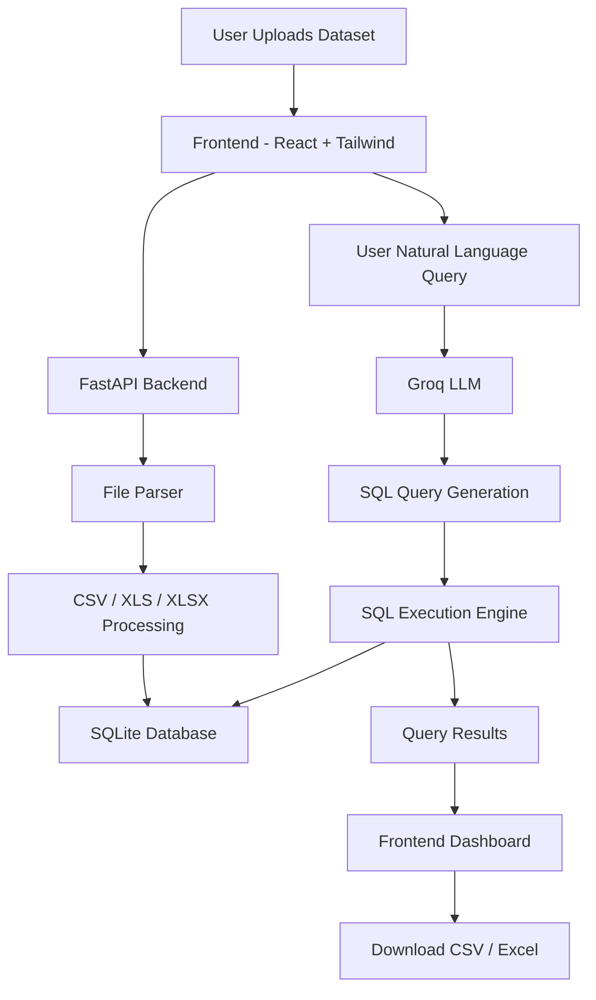

# 🚀 NLQG — Natural Language Query Generator

### Convert Natural Language into SQL Queries Instantly

Ask questions in plain English and get automatically generated SQL queries from uploaded datasets — no SQL knowledge required.

[🌐 **Live Demo:**](https://nl2sqlg.netlify.app/)  

---

## 📌 About the Project

**NLQG (Natural Language Query Generator)** is a **Generative AI-powered SQL query platform** that enables users to interact with structured datasets using **natural language instead of SQL**.

Users can upload datasets in **CSV, XLS, and XLSX** formats and ask questions in plain English. The system automatically generates SQL queries, executes them dynamically on a SQLite database, and returns query results instantly.

### ✅ Key Highlights

- Convert plain English questions into SQL queries
- Upload CSV, XLS, XLSX datasets
- Dynamic SQLite database creation
- AI-generated SQL using **Groq LLM**
- Supports:
  - Filtering conditions
  - Nested queries
  - Compound conditions
  - Aggregations
  - Sorting & Grouping
  - Date-based queries
- Download query results as **CSV** or **Excel**
- Search functionality inside query results
- SQL Copy Button
- Dark / Light mode UI
- Responsive and modern interface

---

## ✨ Features

### 📂 Dataset Upload
- Upload datasets in:
  - CSV
  - XLS
  - XLSX
- Automatic schema detection
- Dynamic database creation

### 🤖 Natural Language → SQL
Convert human language into executable SQL queries.

Examples:

**Input:**
```text
Show all movies released after 2018
```

**Generated SQL:**
```sql
SELECT * FROM uploaded_table
WHERE release_year > 2018;
```

Supports:

- WHERE conditions
- LIKE queries
- Aggregations (`AVG`, `COUNT`, `SUM`)
- GROUP BY
- ORDER BY
- Nested Queries
- Compound Conditions
- Date Queries
- Dynamic filtering

---

### 📊 Query Results Dashboard

- Interactive result tables
- Search inside results
- Handles missing values safely
- Scrollable large datasets
- Responsive UI

---

### 📥 Export Results

Download results in:

- CSV format
- Excel (.xlsx) format

---

### 📋 SQL Copy Feature

Copy generated SQL instantly using a one-click copy button.

---

## 🏗️ System Architecture



---

## 🛠️ Tech Stack

### Frontend
- React.js
- Tailwind CSS
- Axios
- Vite

### Backend
- FastAPI
- Python
- SQLite
- Pandas
- Uvicorn

### AI / LLM
- Groq API
- LLaMA Models

### Deployment
- Frontend → Netlify
- Backend → Render

---

## 📂 Project Structure

```bash
NLQG-PROJECT/
│
├── frontend/
│   ├── src/
│   │   ├── components/
│   │   ├── services/
│   │   └── App.jsx
│   │
│   ├── package.json
│   └── vite.config.js
│
├── backend/
│   ├── utils/
│   │   ├── db_manager.py
│   │   ├── downloader.py
│   │   ├── file_parser.py
│   │   ├── sql_generator.py
│   │   └── visualizer.py
│   │
│   ├── app.py
│   ├── requirements.txt
│   └── .env
│
└── README.md
```

---

## ⚙️ Installation Guide

### 1️⃣ Clone the Repository

```bash
git clone https://github.com/ashutoshm2004/NLQG-PROJECT.git
cd NLQG-PROJECT
```

---

### 2️⃣ Backend Setup

```bash
cd backend
pip install -r requirements.txt
```

Create a `.env` file:

```env
GROQ_API_KEY=your_api_key_here
```

Run backend:

```bash
uvicorn app:app --reload
```

---

### 3️⃣ Frontend Setup

```bash
cd frontend
npm install
npm run dev
```

---

## 🌍 Deployment

### Frontend (Netlify)
Deployed on:

🔗 https://nl2sqlg.netlify.app/

### Backend (Render)
Hosted using FastAPI + Render.

---

## 🔐 Security

Sensitive API keys are securely stored using `.env` files and excluded from version control using `.gitignore`.

---

## 🎯 Future Improvements

- Data visualization charts
- Multi-table joins
- Better prompt engineering
- Query history
- User authentication
- Smart schema understanding
- Better SQL validation

---

## 👨‍💻 Author

### Ashutosh Kshitij Mishra | [💼 LinkedIn](https://www.linkedin.com/in/ashutoshm04/) | [🐙 GitHub](https://github.com/ashutoshm2004)

---
